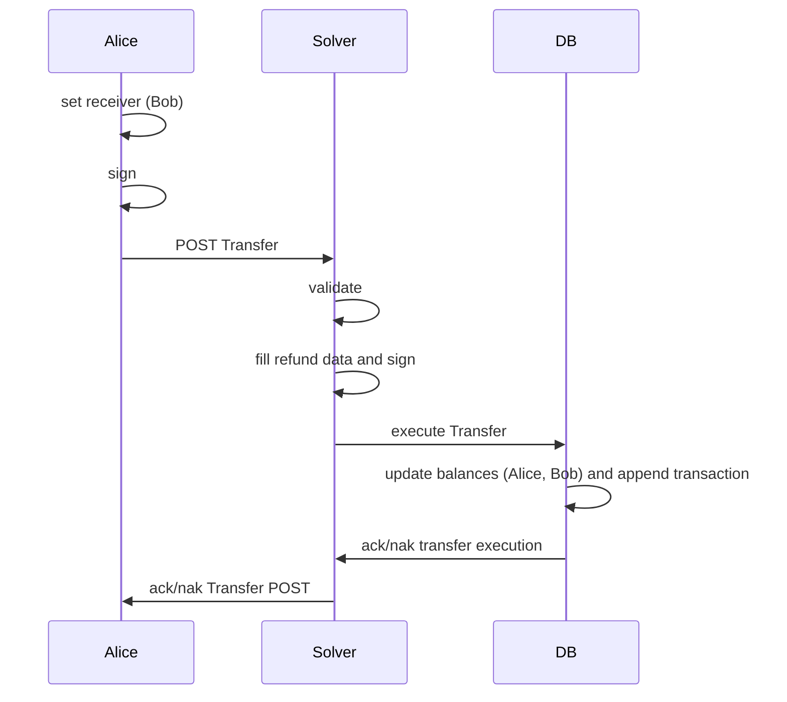
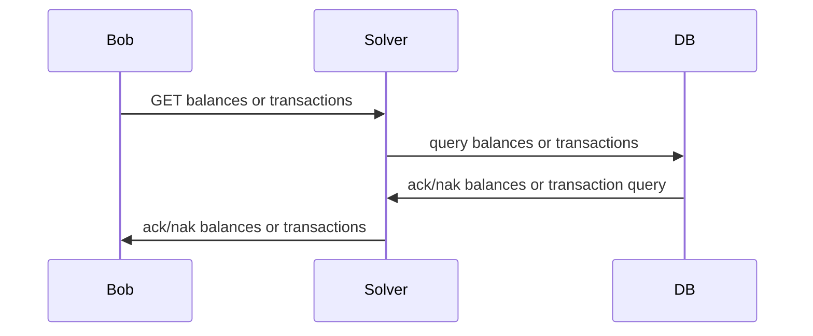
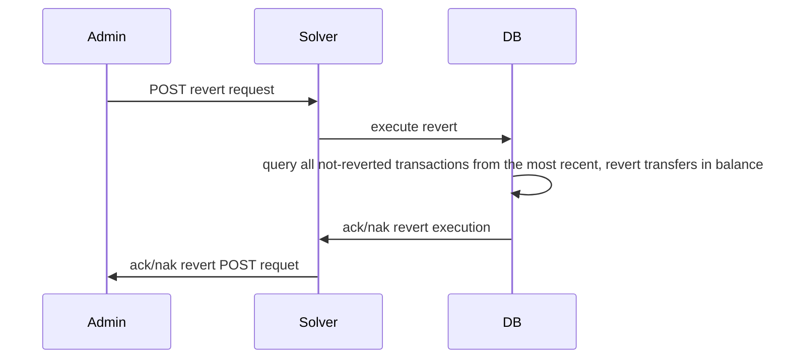

# OB Code Test

## Rationale

To "Develop a system with TypeScript that will receive signed transfer objects from
the user and relay them to a market maker for execution (the chain execution
can be mocked)." I imagined a REST service executing transfers to a relational database representing the market.

The DB assures "user balances need to be locked such that no race conditions".
The REST service assures to "process requests concurrently using asynchronous best practices."

The REST service "will sign the transfer object as well and approve with it the
correctness of this user request after it validates the user balance" as represented the sequence diagram.

I was very confused by the term "solver", mulling the homework requires to stage two REST services, the first
verifying the request signature, signing and the second verify the REST signature, but this approach 
doesn't represent any proof-of-kowledge of myself as candidate, except the stack of two (micro) services
in a synchronous or asynchronous mode, scope of a system design inteview, hence I opted to consider
the REST Service as "the solver" and to image "the solver" has an administrator should be authenticated to execute
the refund of transfers.



I imagined any stakeholder identifies by its account can ask for balances and transfers. 



The "solver" administrator has an authenticated and authorized access (omitted in this homework) to an end-point
to ask to revert all the transfers not already reverted, executing from the most recent.

I'm unsure if the homework requires to revert the transacton one by one as done, but it seems to me a requirement
limiting my possibility to play, hence I imagined a service triggered by its end-point reverting all the
not-yet-reverted transactions, anytime.



The proposed data structure for the "transfer object" leaves big space to imagine the precise meaning of its
properties.

I decided to represent the "transfer object" as a `src/dto/Transfer.ts` interface where

* `.sender` is sender of the transfer paying to the
* `.receiver` of the transfer an
* `.token.amount` in
* `.token.address` denomination `0xF0CACC1A`.

To represent the "market" and accomplish the not-functional requirements of
"user balances need to be locked such that no race conditions appear in case the user sends multiple requests" ,
I decided to use PostgreSQL, albeit it seems an overkilling approach, it's so common and well documented,
it requires very little effort to integrate in a JS/TS project.

The "transfer objects" operate in two tables

* `balances` for each service stakeholder;
* `transactions` to provide the functional requirements of
  "an interface that allows the API service to request the execution status" ,and
  "trigger the execution of the refund transaction after the solver has successfully executed the transfer object".

The homework introduces the "solver" persona as "The solver provides...": I'm confused if such "solver" is me or
the service executing the "market" "transfer" requests: I chose the latter interpretation and since
"The API service will sign the transfer object", the "solver" has its address and private key to perform the operation.
using the `.refund` property to encode

* `refund.tx`: time stamp and KECCAK `Transfer` hash
* `refund.signedTx`: "solver"'s signature of `refund.tx`.

The "refund" is represented by the `src/dto/Refund.ts` interface and can be optional present in `transaction`
because it is the data structure the "solver" service fills to sign as "solver" and send to the "market", hence
the database, the data to build the "transaction" records, used later to refund.

The homework imagines four stakeholders build from secret mnemonic

```text
sweet attitude face lyrics resemble put pattern face impact fat honey runway
```

The four stakeholders are

```text
Secret Mnemonic: sweet attitude face lyrics resemble put pattern face impact fat honey runway
SOLVER - Address 0: 0x4c066bAC41dC11b7029D06826093202154280709 PRV: 0x2feb4c1dcc3d4de880c585f988ee711baa54bddf1c59c84af3efaab2d248ec6f PUB: 0x020d0a1137fc59d6c4c10fa053c7804f5c43a33eb259ffe01541bf6a3a55006327
ALICE  - Address 1: 0x095182ADDea1Dd59221D1750D95f78b0c15B0e1C PRV: 0x48d406c92700d07721f6d094d52d14b59348300569c0090dad07b814cc6ae1a6 PUB: 0x02988a6717c6828a3df1a2ab129ab08e2a4e819bef845595a9ad52b67539ef7bf9
BOB    - Address 2: 0x9D3860f1Fab70216Db9a2bcAb63EE9576da0d926 PRV: 0xfdb48c472288d64d6f6cba0c28257638974a97b186090533bc845ebbdcdca47b PUB: 0x03c3a15415cfd56f33ac5e460485d74d08a028ac883af23557be23cb9a207ac07c
CHARLE - Address 3: 0x5965c1C60b5191bd270d385589355503f575a136 PRV: 0xf0d297cce44d996fd032d9a8d69bd459958cb121db23c2ab47733653bba0a428 PUB: 0x025120c1e227f6822910092838fe330637780d641f278997695a17b7abcddb0660
```

The file at `src/crypto/crypto.ts` shows how accounts are created and provides basic functionalities to sign and
sign and verify `Transfer` objects.

The requirements state "The token locks need to be kept in-memory as well as in a key-value store
in case of a service failure."
The use of "Node.JS" v23.1.0 and [expressjs](https://expressjs.com/) as library to build a REST
service allows the possibility multiple workers serve the requests, hence the lock of the transaction is
performed by the `src/synch/ThreadSafeMap.ts` class.

The combination of the `Transfer` properties `

* `.sender`,
* `.receiver`,
* `.token.amount`,
  are used to generate the "lock key" used to synchronize transfers: only one transfer can be executed between two
  stakeholder addresses and the same token address.

The REST service provides few ancillary services to debug and experiment with it

* `GET /balances` - Returns the list of all the balances of addressed stakeholder.
* `GET /balances/:address` - Returns the list of all the balances of a specific stakeholder identified by its address.
* `GET /balances/:address/:token` - Returns the balance of token of a specific stakeholder identified by its address.

## Set-up

### PostgreSQL

[Install Postgres](https://www.postgresql.org/download/)

To configure PostgreSQL, use the `psql` CLI

```shell
psql postgres
```

From `psql` create

* the `ob` database, administrated by
* the `ob` user
* having `ob` password.

```postgresql
create database ob;
create user on with encrypted password 'ob';
grant all privileges on database ob to ob;
\c ob ob
```

You are now connected the `ob` database as `ob` system administrator.

The "market" is represented in the `balances` table.
The following SQL instructions create the table and three balances.

```postgresql
drop table balances;

create table balances
(
    pladdress varchar(42) not null,
    token     varchar(42) not null,
    amount    numeric     not null,
    primary key (address, token)
);

insert into balances(address, token, amount)
values ('0x095182ADDea1Dd59221D1750D95f78b0c15B0e1C', '0xF0CACC1A', 128),
       ('0x9D3860f1Fab70216Db9a2bcAb63EE9576da0d926', '0xF0CACC1A', 256),
       ('0x5965c1C60b5191bd270d385589355503f575a136', '0xF0CACC1A', 512);
```

The transactions are represented in the `transactions" table created empty as

```postgresql
drop table transactions;

create table transactions
(
    tx_ts    varchar(20) not null,
    tx_id    varchar(66) not null,
    sender   varchar(42) not null,
    receiver varchar(42) not null,
    token    varchar(42) not null,
    amount   numeric     not null,
    reverted bool        not null,
    primary key (tx_ts, tx_id)
);
```

## JS/TS

```shell
yarn install
```

## Run


